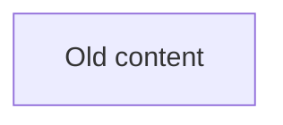

# Go Code Grapher

A tool for generating mermaid diagrams from Go code, with support for automatic embedding into markdown documentation.

## Features

- Generate mermaid diagrams from Go code imports
- Export diagrams to files or stdout
- **Markdown embedding**: Automatically update diagrams in documentation with annotation markers

## Installation

```bash
go install github.com/daanv2/go-code-grapher@latest
```

## Usage

### Basic Usage

Generate an import graph for your Go project:

```bash
go-code-grapher imports --dir ./pkg
```

### Markdown Embedding

The tool supports automatic embedding of generated diagrams into markdown files using annotation markers.

#### Quick Start

1. Add markers to your markdown file:

```markdown
<!-- mermaid-embed-start:my-diagram -->

<!-- mermaid-embed-end:my-diagram -->
```

2. Generate and embed the diagram:

```bash
go-code-grapher imports \
  --markdown-embed-into ./docs/ARCHITECTURE.md \
  --markdown-embed-id my-diagram \
  --dir ./pkg
```

#### Annotation Strategy

- Use HTML comments to mark sections: `<!-- mermaid-embed-start:ID -->` and `<!-- mermaid-embed-end:ID -->`
- IDs must be alphanumeric with optional hyphens and underscores
- Each section must have matching start and end markers

For complete documentation on markdown embedding, see [docs/MARKDOWN_EMBEDDING.md](./docs/MARKDOWN_EMBEDDING.md).

## Contributing

When contributing documentation with mermaid diagrams, please use the annotation strategy to enable automatic updates. See [docs/MARKDOWN_EMBEDDING.md](./docs/MARKDOWN_EMBEDDING.md) for details.