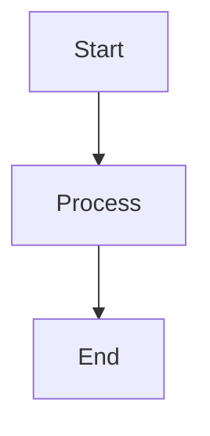
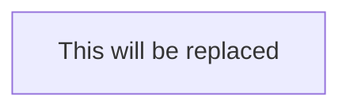

# Markdown Embedding Feature

This document explains how to use the markdown embedding feature to automatically update mermaid diagrams in your documentation.

## Overview

The markdown embedding feature allows you to mark specific sections in your markdown files that contain mermaid diagrams. These sections can then be automatically updated with newly generated diagrams using command-line flags.

## Annotation Strategy

To mark a mermaid diagram for automatic updates, you need to add a start marker before the code block. The end marker is **optional** - if not provided, the system will automatically detect the end of the code block by finding the closing ``` after the start marker.

**With end marker (explicit):**
```markdown
<!-- mermaid-embed-start:your-diagram-id -->

<!-- mermaid-embed-end:your-diagram-id -->
```

**Without end marker (automatic detection):**
```markdown
<!-- mermaid-embed-start:your-diagram-id -->

```

### Marker Format

- **Start marker**: `<!-- mermaid-embed-start:ID -->` (required)
- **End marker**: `<!-- mermaid-embed-end:ID -->` (optional)
- **ID**: Must be alphanumeric with optional hyphens and underscores (e.g., `architecture`, `import-flow`, `data_model`)

### Rules

1. Each section must have a start marker with a unique ID
2. End markers are optional - if not provided, the system will find the closing ``` of the code block
3. If an end marker is provided, it must match the ID of the start marker
4. Sections cannot be nested
5. IDs must be unique within a markdown file
6. IDs can only contain: letters, numbers, hyphens (-), and underscores (_)

## Usage

### Generating Diagrams with Embedding

To generate a diagram and embed it into a markdown file, use the `--markdown-embed-into` and `--markdown-embed-id` flags:

```bash
# Generate an import graph and embed it into a markdown file
go-code-grapher imports \
  --markdown-embed-into ./docs/ARCHITECTURE.md \
  --markdown-embed-id imports-diagram \
  --dir ./pkg

# You can also specify other options
go-code-grapher imports \
  --markdown-embed-into ./README.md \
  --markdown-embed-id architecture \
  --graph-only false \
  --grapher-id mermaid
```

### Required Flags

- `--markdown-embed-into`: Path to the markdown file to update
- `--markdown-embed-id`: ID of the section to replace (must match the ID in the markers)

### Example Workflow

1. Add a start marker to your markdown file (end marker is optional):

```markdown
# Architecture

Our system architecture:

<!-- mermaid-embed-start:architecture -->


More documentation here...
```

2. Run the command to update the diagram:

```bash
go-code-grapher imports \
  --markdown-embed-into ./docs/ARCHITECTURE.md \
  --markdown-embed-id architecture \
  --dir ./pkg
```

3. The content from the start marker to either the end marker (if present) or the closing ``` will be replaced with the newly generated diagram. The output will always include both start and end markers.

## Notes

- The `--output` flag is ignored when using markdown embedding
- When both `--markdown-embed-into` and `--output` are specified, markdown embedding takes precedence
- Always ensure your markdown file has the markers before running the embed command
- The tool will return an error if the specified section is not found

## Examples

See [EXAMPLE.md](./EXAMPLE.md) for a complete example with annotated diagrams.
